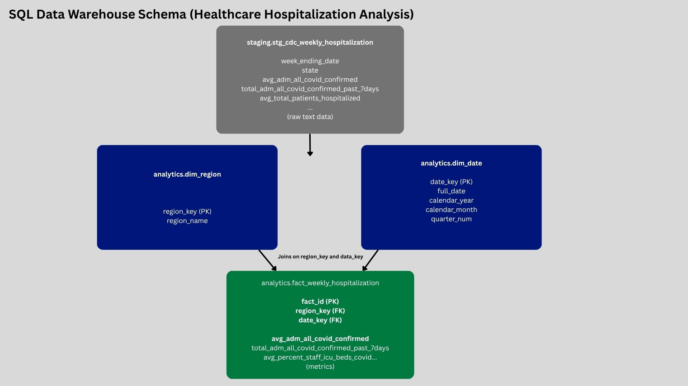
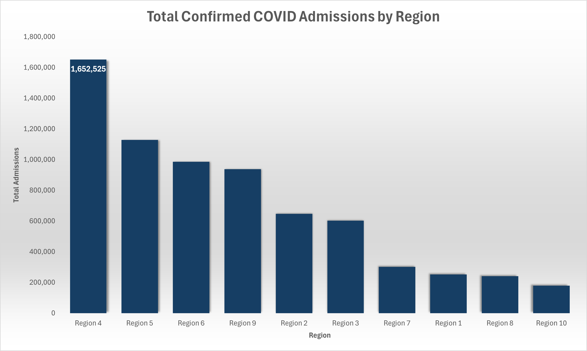
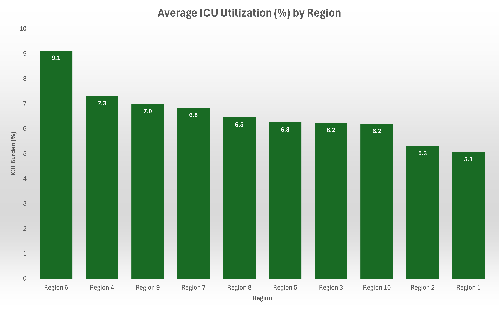
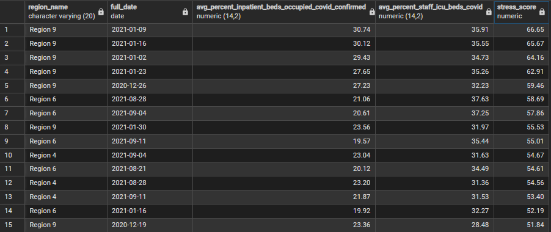

# 🏥 Healthcare Hospitalization Analysis  
### SQL Data Warehouse & Analytics Project

---

## 📌 Project Overview

This project focuses on designing and implementing a structured SQL-based data warehouse to analyze weekly COVID-19 hospitalization data across U.S. regions.  

The goal was to transform raw CDC data into a clean, queryable format and generate insights related to hospital admissions, ICU utilization, and overall healthcare system strain.

---

## 🧠 Objectives

- Build a structured data model for healthcare analytics  
- Clean and transform raw hospitalization data  
- Analyze trends in admissions and ICU utilization  
- Identify periods of high healthcare system stress  
- Demonstrate advanced SQL techniques (joins, aggregations, CTEs, window functions)

---

## 🏗️ Data Model

The data warehouse follows a dimensional modeling approach:

- **Staging Layer:** Raw CDC data stored as text for flexible ingestion  
- **Dimension Tables:**  
  - `dim_region` → regional classifications  
  - `dim_date` → time-based attributes  
- **Fact Table:**  
  - `fact_weekly_hospitalization` → weekly metrics by region and date  

---

## 📊 Visual Analysis

### Data Model

---

### Total Confirmed COVID Admissions by Region

**Insight:**  
Regions show significant variation in total admissions, with certain regions experiencing substantially higher healthcare demand.

---

### Average ICU Utilization (%) by Region

**Insight:**  
ICU utilization varies across regions, highlighting differences in healthcare system strain and capacity.

---

### Highest Stress Weeks Across Regions

**Insight:**  
Periods of highest stress are driven by a combination of high inpatient bed occupancy and ICU utilization, indicating peak system strain.

---

## 🧪 Key SQL Techniques

This project demonstrates:

- Multi-table joins across fact and dimension tables  
- Aggregations for regional comparisons  
- Common Table Expressions (CTEs)  
- Window functions (RANK, LAG, moving averages)  
- Time-based trend analysis  

---

## 🛠️ Tools & Technologies

- PostgreSQL  
- SQL  
- Excel (for visualization)  
- Data Modeling (Star Schema)

---

## 📁 Project Structure

    01_create_schemas.sql
    02_staging_tables.sql
    03_dimension_tables.sql
    04_fact_table.sql
    07_analysis_queries.sql
    images/

---

## 🚀 Key Takeaways

- Built a scalable SQL data model for healthcare analytics  
- Transformed raw data into structured insights  
- Identified regional disparities in hospital utilization  
- Highlighted peak stress periods in the healthcare system  

---

## 🔗 Author

**Christina Foy-Bowman**  
Data Analyst
